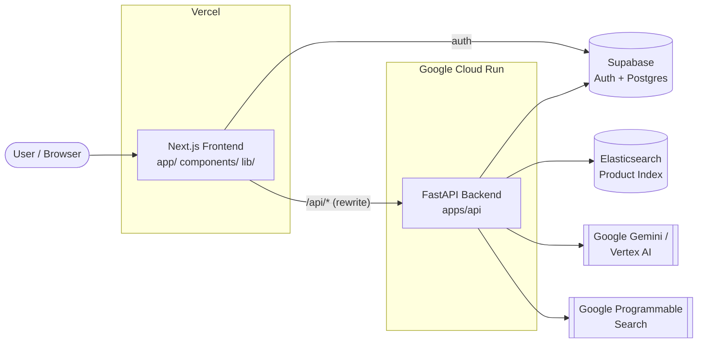

# Architecture

This document gives a high-level overview of how Dermalens is structured and how
data flows through the system.

## Overview

Dermalens is a full-stack, AI-powered skincare analysis platform composed of two
independently deployed services:

- **Frontend** — a Next.js 14 (App Router) + TypeScript app deployed to **Vercel**.
- **Backend** — a FastAPI service (`apps/api`) deployed to **Google Cloud Run**.

The frontend talks to the backend over HTTPS. In production, Vercel rewrites
`/api/*` to the Cloud Run service so the browser only ever calls the frontend origin.

## System diagram

## Components

### Frontend (`app/`, `components/`, `lib/`, `contexts/`)

- **`app/`** — App Router pages: `scan`, `dashboard`, `products`, `profile`,
  `settings`, `login`, `signup`, and API route handlers under `app/api/`.
- **`components/`** — Feature components (face capture, product grid, routine
  chatbot) and `components/ui/` (shadcn/ui primitives).
- **`lib/`** — Shared utilities (e.g. the `cn` class-name helper).
- **`contexts/`** — React context providers (user/session state).

### Backend (`apps/api/`)

- **`main.py`** — FastAPI app and HTTP routes (see [API.md](API.md)).
- **`ai/`** — Analysis and recommendation services (Gemini, Vertex AI, ensemble).
- **`infrastructure/`** — Integrations: Elasticsearch, Google Search, caching,
  validation.
- **`core/`** — Authentication.
- **`database/`** — Supabase/Postgres connection and data models.
- **`monitoring/`** — Performance metrics.

## Data flow: a skin scan

1. The user captures or uploads a face photo on `/scan`.
2. The frontend sends the image to the backend (`POST /analyze-skin*`).
3. The backend runs AI analysis (Gemini / Vertex AI), optionally ensembling
   multiple models, and derives skin conditions and severity.
4. Recommendations are generated and products are retrieved from Elasticsearch
   (with Google Search as a fallback/enrichment source).
5. The routine generator composes a personalized morning/evening routine, which
   is validated for safety by `infrastructure/validation_service.py`.
6. Results and the user's skin profile are persisted in Supabase and returned to
   the frontend for display.

## Cross-cutting concerns

- **Auth:** Supabase Auth (JWT). The backend verifies tokens on protected routes.
- **Config:** Environment variables only; see [`.env.example`](../.env.example).
  No secrets are committed.
- **Testing:** Jest + React Testing Library (frontend), pytest (backend).
- **CI/CD:** GitHub Actions (lint, test, coverage, CodeQL, dependency review);
  Vercel (frontend deploy) and Cloud Build → Cloud Run (backend deploy).

## Deployment topology

| Service  | Source     | Build              | Host             |
| -------- | ---------- | ------------------ | ---------------- |
| Frontend | repo root  | `next build`       | Vercel           |
| Backend  | `apps/api` | `cloudbuild.yaml`  | Google Cloud Run |

> **Note:** The repository also contains `docs/archive/legacy-backend/`, an older
> non-deployed backend kept for reference only.
